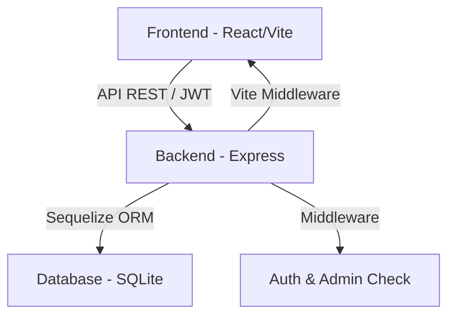

# Cartola-Kings-League


O **Cartola Kings League** é uma plataforma de Fantasy Football inspirada na Kings League. O sistema permite que usuários gerenciem seus próprios times, comprem e vendam jogadores com um orçamento virtual e disputem pontuações baseadas no desempenho real (ou simulado) dos atletas.

## 🏗️ Arquitetura do Sistema

O projeto segue uma arquitetura cliente-servidor moderna:



### Tecnologias Utilizadas
- **Frontend:** React 19, Vite, Tailwind CSS (v4), Lucide React (Ícones).
- **Backend:** Node.js, Express, Sequelize (ORM), SQLite3.
- **Segurança:** JSON Web Tokens (JWT) e Bcryptjs para hashing de senhas.

## 📁 Estrutura do Projeto

```text
├── backend/
│   ├── config/         # Configurações de banco de dados
│   ├── controllers/    # Lógica de negócio por entidade
│   ├── models/         # Definições de tabelas (Sequelize)
│   ├── routes/         # Definição de endpoints (Auth, Escalacao)
│   └── src/app.js      # Ponto de entrada e configuração do servidor
├── src/
│   ├── components/     # Componentes React (Admin, MyTeam, etc.)
│   └── ...             # Views e lógica do frontend
└── package.json        # Dependências e scripts
```

## 🚀 Funcionalidades Implementadas

- [x] **Autenticação:** Registro e Login com diferenciação de papéis (User/Admin).
- [x] **Gestão de Elenco:** Endpoint para escalação (compra/venda) respeitando saldo financeiro.
- [x] **Painel Admin:** Interface para gerenciar usuários, cadastrar jogadores e simular rodadas.
- [x] **Simulação de Rodada:** Algoritmo básico que gera estatísticas aleatórias e atualiza pontuações.
- [x] **Logs do Sistema:** Redirecionamento de logs do console para arquivo físico (`server.log`).

## 🛠️ O que falta fazer (Roadmap)

### 1. Mercado de Jogadores (Frontend)
Desenvolver a interface visual para o "Mercado", permitindo que o usuário veja a lista global de jogadores, filtre por posição e realize a compra diretamente pela UI.

### 2. Dashboard de Classificação (Leaderboard)
Criar uma tela de ranking global para que os usuários comparem suas pontuações totais.

### 3. Histórico de Rodadas
Implementar uma tabela no banco de dados para salvar os resultados de cada rodada simulada, permitindo que o usuário veja o desempenho passado.

### 4. Validação de Formação (11 Jogadores)
Embora o backend limite a 11 jogadores, o frontend precisa de uma visualização de "Campo" para organizar os jogadores por posição (GOL, ZAG, MEI, ATA).

### 5. Refatoração de Modelos
Mover as definições de associações do Sequelize do `app.js` para um arquivo de configuração centralizado de modelos para melhor manutenibilidade.

## 🔧 Como Executar

1. **Instalação:**
   ```bash
   npm install
   ```

2. **Configuração:**
   Crie um arquivo `.env` na raiz (opcional) ou o sistema usará a `JWT_SECRET` padrão.

3. **Iniciar em Desenvolvimento:**
   ```bash
   npm run dev
   ```
   O servidor rodará na porta `3000`, servindo o backend e o frontend simultaneamente via Vite middleware.

4. **Popular Banco de Dados:**
   O sistema possui um auto-seed no `app.js` que insere jogadores iniciais caso o banco esteja vazio.

---
*Projeto desenvolvido como parte do programa DEVSQUAD.*
