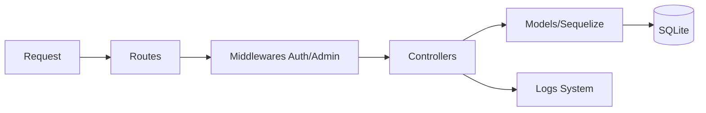

# 🛡️ Cartola Kings League - Backend API

Esta é a camada de serviços e persistência do sistema. Construída com **Node.js** e **Express**, utiliza o **Sequelize ORM** para interagir com um banco de dados **SQLite**, garantindo agilidade no desenvolvimento e portabilidade.

## ⚙️ Arquitetura de Software

O backend segue o padrão de camadas para separação de responsabilidades:

## 📂 Estrutura Interna

-   **`src/app.js`**: Ponto de entrada, configuração de middlewares globais (CORS, Morgan), sincronização do banco e integração com o Vite.
-   **`models/`**: Definição do schema das tabelas (Usuários, Jogadores, Escalações).
-   **`routes/`**: Definição dos endpoints REST.
-   **`controllers/`**: Onde reside a lógica de negócio principal.
-   **`config/database.js`**: Instância e conexão do Sequelize.
-   **`scripts/seed.js`**: Utilitário para popular o banco a partir de arquivos JSON.

## 🛠️ Status do Desenvolvimento

### Concluído ✅
- [x] **Core Server**: Setup com logs persistentes em `server.log`.
- [x] **Auth System**: Middleware JWT e hashing de senhas com Bcrypt.
- [x] **Market Logic**: Endpoints de compra e venda com validação de saldo.
- [x] **Simulation Engine**: Algoritmo para geração de scouts e atualização de pontuação.
- [x] **Admin API**: CRUD de usuários e controle de acesso privilegiado.

### Em Progresso ⏳
- [ ] **Refatoração de Associações**: Mover as associações do `app.js` para um arquivo `models/index.js`.
- [ ] **Centralização de Erros**: Criar um middleware global para tratamento de exceções.

### Pendente (Próximos Passos) 🚀
1.  **Histórico de Rodadas**: Criar tabela `Rodada` para salvar o "snapshot" de pontos de cada usuário por semana.
2.  **Validação de Formação**: Implementar lógica no `EscalacaoController` para impedir escalações que não respeitem formações táticas (ex: 4-3-3).
3.  **Ranking Otimizado**: Criar uma View ou Query otimizada para o Leaderboard, evitando loops pesados no JS.
4.  **Upload de Imagens**: Integrar Multer para permitir fotos dos jogadores e escudos dos times.

## 🚦 Endpoints Principais

| Método | Rota | Proteção | Descrição |
| :--- | :--- | :--- | :--- |
| `POST` | `/api/auth/register` | Pública | Registro de novos jogadores |
| `POST` | `/api/auth/login` | Pública | Login e geração de Token JWT |
| `GET` | `/api/jogadores` | Usuário | Lista mercado de jogadores |
| `POST` | `/api/escalacao/comprar` | Usuário | Adiciona jogador ao time (gasta saldo) |
| `POST` | `/api/simulate-round` | **Admin** | Executa simulação e distribui pontos |

## 📝 Notas de Manutenção

### Logs
Todos os eventos críticos e erros são espelhados no arquivo `server.log`. Em caso de erro 500, este é o primeiro lugar a ser consultado.

### Banco de Dados
O arquivo `database.sqlite` é gerado automaticamente. Para resetar o ambiente:
1. Apague o arquivo `.sqlite`.
2. Execute `node scripts/seed.js` para repopular os dados iniciais.

---
*Backend documentation by Senior Dev Team*